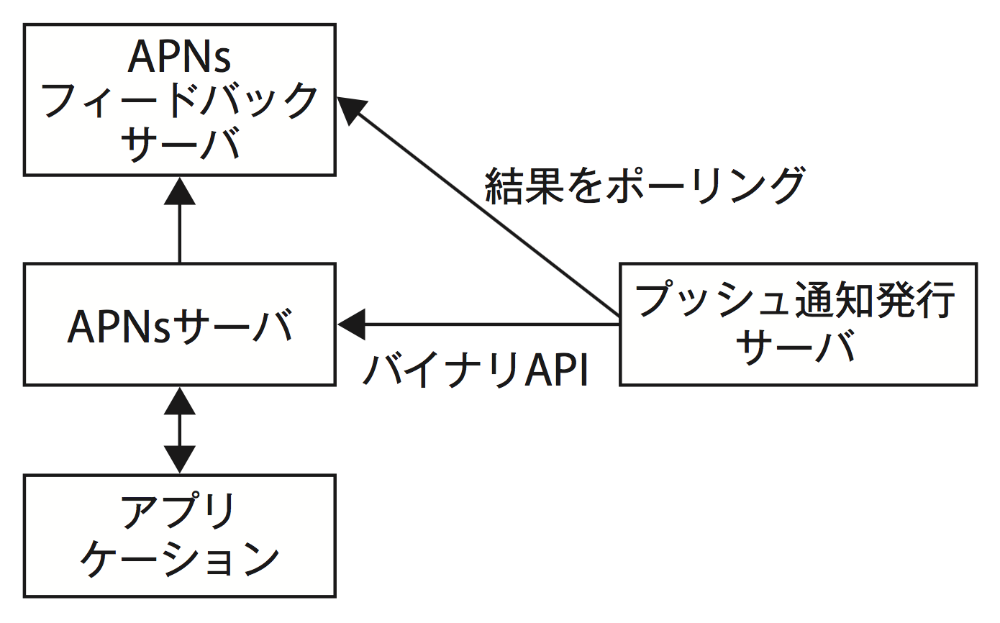
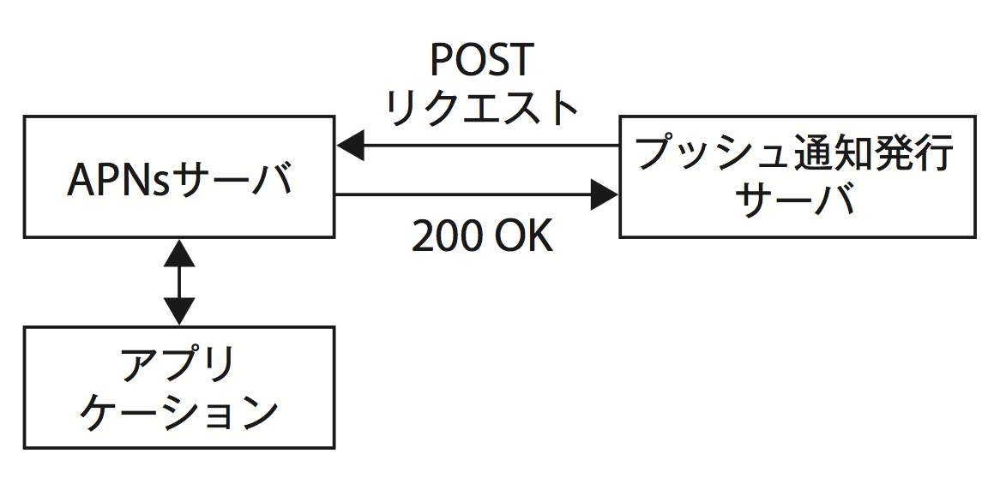

# Chapter 2
Hello, world!

## 2.2 プッシュ通知送信の2つの方式

現状、プッシュ通知送信の方式は2つあり、本書では後発で洗練されて使いやすいHTTP/2方式でのやり方で説明していきます。

- [HTTP/2方式](https://developer.apple.com/library/content/documentation/NetworkingInternet/Conceptual/RemoteNotificationsPG/APNSOverview.html#//apple_ref/doc/uid/TP40008194-CH8-SW1)
  - 2015年12月から使えるようになった新しい方式
- Binary Provider API
  - [レガシーな方式](https://developer.apple.com/library/content/documentation/NetworkingInternet/Conceptual/RemoteNotificationsPG/BinaryProviderAPI.html#//apple_ref/doc/uid/TP40008194-CH13-SW1)

以前のBinary Provide APIでは、APNsサーバにリクエストした通知が成功したかどうかを知るには、通知発行元のサーバが別のAPNsフィードバックサーバにいちいち問い合わせ（ポーリング）しなくてはいけない作りになっていました。また、APNsサーバへのリクエストも[バイナリAPIというWeb標準ではない独特のもの](https://developer.apple.com/library/content/documentation/NetworkingInternet/Conceptual/RemoteNotificationsPG/LegacyNotificationFormat.html#//apple_ref/doc/uid/TP40008194-CH14-SW1)でした。

そして、2015年12月にHTTP/2の方式が使えるようになり、それは直接結果を受け取れる自然な構成となっています。また、1接続で並行して通知リクエストを行え、効率良く処理が可能となります。

通知発行結果は、[レスポンスに含まれる9種類のステータスコード・Reason](https://developer.apple.com/library/content/documentation/NetworkingInternet/Conceptual/RemoteNotificationsPG/CommunicatingwithAPNs.html#//apple_ref/doc/uid/TP40008194-CH11-SW1)で、次のような項目を判別でき、それによって適切なハンドリングが可能です。

- 通知が成功したか
- 証明書の期限が切れていないか
- リクエスト数が制限されていないか
- ペイロードサイズが大きすぎないか

{title="TODO"}
| Binary Provider API | HTTP/2方式 |
| --- | --- |
|  |  |

A> ## おまけ
A>
A> コラム的な何か