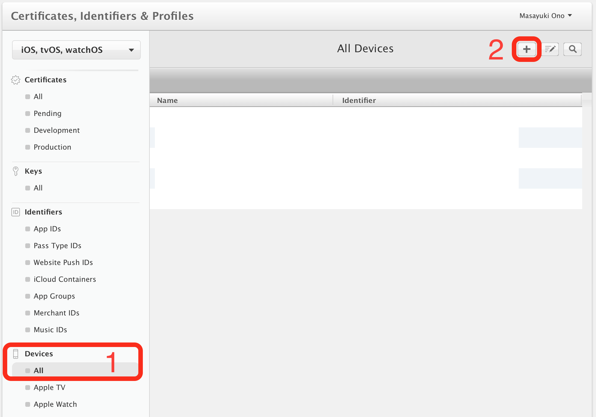

# 第3章 iOS プッシュ通知の基本的な実装方法

この章では、iOSアプリでプッシュ通知を受け取るためにまず必要な、device token(デバイストークン)を取得する手順を説明していきます。

## 3.1 はじめに

はじめに、device tokenの簡単な説明と、前もって必要な前提条件について説明します。

### device token(デバイストークン)とは？

プッシュ通知を発行する際に、その発行先をdevice tokenで指定します(次の章で詳しく説明します)。device tokenは、端末・アプリごとに一意となっていて、1つの有効なdevice tokenへ発行した通知はただ1つの端末の1つのアプリにのみ届くようになっています。また、そのアプリがアンインストールされた際などにそのdevice tokenは無効となり、そのdevice tokenへ向けてプッシュ通知を発行しても失敗し不達となります。

この章ではそのdevice tokenを取得する方法に絞って説明していきます。iOSアプリでのプッシュ通知周りの実装は多岐に渡りますが、それらは後の章で扱います。また、第2章で説明した通り、プッシュ通知発行は2015年12月にHTTP/2形式の新しいやり方ができたため、そちらでのやり方で説明していきます。

### [Apple Developer Program](https://developer.apple.com/programs/jp/)への登録

単に実機実行したいだけであれば、[Xcode 7以降は無料で行えるようになりました](http://qiita.com/FumihikoSHIROYAMA/items/a754f77c41b585c90329)。ただ、プッシュ通知を使う場合は、開発者登録して、明示的なApp ID(Wildcaseでは無いApp ID)を生成する必要があります。このApp IDでアプリが一意に区別されます。

そのため、プッシュ通知に対応するアプリを作るには[Apple Developer Program](https://developer.apple.com/programs/jp/)への登録が必須です。個人の場合は、2017年7月7日時点で年間11,800円です。詳しくは公式サイトの説明などご覧ください。本書では具体的な登録手順は割愛し、開発者登録済みの前提で説明していきます。


## 3.2 [iOS Certificates - Apple Developer](https://developer.apple.com/account/ios/certificate)でプッシュ通知用のKeyファイルを作成

まずは、プッシュ通知用のKeyファイルを作成していきます。

### [iOS Certificates - Apple Developer](https://developer.apple.com/account/ios/certificate)にアクセス

[Apple Developer Account](https://developer.apple.com/account/)サイトトップに、`Certificates, IDs & Profiles`へのリンクがあるのでそこから[iOS Certificates - Apple Developer](https://developer.apple.com/account/ios/certificate)にアクセスできます。

{cite: "TODO: cite"}


では、以下このサイト上での各手順を説明していきます。すでに作成済みの項目があれば適宜スキップしてください。

### プッシュ通知発行に必要なKeyファイルを生成・ダウンロード

次の手順通りに操作して、プッシュ通知発行に必要なKeyファイルを生成・ダウンロードしておきます。

1. Keys -  Allを選択
2. +ボタンを押す
3. Key名を入力
    - 区別できれば何でも良い
4. APNsのチェックをつける
    - [DeviceCheck](https://developer.apple.com/documentation/devicecheck)のチェックはどちらでも良い
5. Confirmを押す
6. Key IDを確認
    - この後、いつでも確認可能
7. Downloadボタンを押して`AuthKey_KEYID.p8`というKeyファイルをダウンロード
    - 記載の説明の通り、ダウンロードは1回しかできないので、ダウンロードしたKeyファイルは速やかに安全な場所に保存
    - これを失くすと、プッシュ通知を送信できず再発行が必要になる


### 端末のUDIDの登録

明示的なApp ID指定をしたアプリを実機実行するには、端末のUDID登録が必要です。

まずは端末のUDIDを[iPhoneなどのUDIDを調べる方法 | MUSHIKAGO APPS MEMO](http://mushikago.com/i/?p=1833)などを参考に調べておきます。

次に、以下の手順で登録します。

1. Devices - Allを選択
2. +ボタンを押す
3. 端末のNameを入力
    - 区別できれば何でも良い
4. 調べておいたUDIDを入力




詳しくは割愛しますが、端末登録は[fastlane/register_devices](https://github.com/fastlane/fastlane/blob/master/fastlane/lib/fastlane/actions/register_devices.rb)という[fastlane](https://fastlane.tools)のアクションを用いることで、コマンドで済ませることもできます。


#### アクションの実行例

```ruby
register_devices(devices_file: "devices.txt")
```

#### デバイス一覧ファイルの例

```txt
Device ID	Device Name
xxxxxxxxxxxxxxxxxxxxxxxxxxxxxxxxxxxxxxxx	Masayuki Ono - iPhone 7 Plus
xxxxxxxxxxxxxxxxxxxxxxxxxxxxxxxxxxxxxxxx	Masayuki Ono - iPhone 7 Plus2
```

## 3.3 Xcode プロジェクトの作成と設定

_これから説明するXcodeプロジェクトのサンプルは、サンプルコードの`Xcode/NotificationExample.xcodeproj`プロジェクトの`Simple`ターゲットに含まれています。_

それでは、早速Xcodeを用いて作業を進めていきます。

### プロジェクトの作成

まずは、プロジェクトを作成します。形式は何でも良いですが、とりあえず一番シンプルな`Single View App`をオススメします。


次に、適当なProduct Name(アプリ名)・Teamを指定して新規アプリを作ります。


### プロジェクト設定(Generalタブ)

まず、プロジェクト設定にて作成したアプリターゲットを選び、Generalタブにて、以下を確認・設定します。

- Identity - Bundle Identifier
  - デフォルトは`Organization Identifier`と`Product Name`が連結されたもの
  - 変えたい場合は、ここで任意のApp IDを設定
  - 自身のドメインを逆にして`.`でアプリ名と連結するのが推奨(例: `com.mono0926.notification.example`)
- Signing - Automatically manage signing
  - オンであること(デフォルト)
  - オフの場合はビルド設定の自由度が上がるが、Provisioning Profileの設定など複雑になる
- Signing - Team
  - アプリ作成時に指定したもので問題なければそのままで良い


もしも不正な設定であれば赤くエラー表示なされます。基本的には[Apple Developer Program](https://developer.apple.com/programs/jp/)にて登録された有効期限内のアカウントがTeamに正しく設定されていれば問題は起こらないはずです。

また、Certificate(証明書)が未作成だった場合、このタイミングでこのように自動生成されることが[iOS Certificates - Apple Developer](https://developer.apple.com/account/ios/certificate)にて確認できます。


### プロジェクト設定(Capabilitiesタブ)

Generalタブの設定がうまくいったら、次に隣のCapabilitiesタブにて、Push Notificationsをオンに切り替えます(デフォルトはオフ)。


同様に、このタイミングで、次のようなApp IDが自動生成されます。プッシュ通知をオンにすると明示的なApp IDが必要となるためです。プッシュ通知はオンになりつつもプッシュ通知用の証明書が紐づいていないためConfigurableの黄色表示(警告表示)ですが、HTTP/2方式のプッシュ通知の場合はこれで問題ないです。

以上の作業は、以前は[iOS Certificates - Apple Developer](https://developer.apple.com/account/ios/certificate)上で色々とややこしい作業が必要でしたが、次の2点の改善によって作業がかなり簡略化されました。

- [Xcode 8で導入されたAutomatically manage signing](https://developer.apple.com/videos/play/wwdc2016/401/)
- HTTP/2方式のプッシュ通知の登場(以前は証明書方式のみ)

ただ、インターネット上の情報は古いものが多かったり、また要件によってはAutomatic Signingだけでは済まないこともあるのは注意してください。

## 3.4 device tokenの取得

それでは、device tokenを取得するための最小限のコードを書いていきます。以下、サポートバージョンはiOS 10以上となります。

まず、`AppDelegate.swift`を開きます。そして、[UserNotifications](https://developer.apple.com/documentation/usernotifications)フレームワークをimportします。これは、iOS 10で新しくできた通知用のフレームワークで、それまでUIKitに包含されていた通知周りが切り出され、以前と比べて大変使いやすくなっています。

{caption: "ファイルの冒頭でUserNotificationsをimport"}
```swift
import UserNotifications
```

次に、`AppDelegate`クラスの[-application:didFinishLaunchingWithOptions:](https://developer.apple.com/documentation/uikit/uiapplicationdelegate/1622921-application?language=objc)という、アプリが終了した状態から起動される度に毎回初めに必ず呼ばれるメソッド内に、以下の処理を書きます。

- 通知許可を求める
- 通知が許可された場合にdevice tokenをリクエスト

<<[TODO: code](codes/chapter3/AppDelegate1.swift)

それでは、上記コードを解説していきます。

### A: 通知許可を求める

[requestAuthorization(options:completionHandler:)](https://developer.apple.com/documentation/usernotifications/unusernotificationcenter/1649527-requestauthorization)というメソッドで、通知許可を求めるアラートを表示します。許可・不許可、いずれか1回選択されたら、以後そのアプリがアラートは出すことができず、変更する場合はユーザーが設定アプリでの変更操作をする必要があります。

そのため、本来はこのアラートはアプリ要件に応じて最適なタイミングで表示することが望ましいのですが、ドキュメントにも、[application:didFinishLaunchingWithOptions:](https://developer.apple.com/documentation/uikit/uiapplicationdelegate/1622921-application)で呼ぶのが基本で、あとで呼ぶ場合は気をつけて調整するように、と書いてあります。後のUXの章でこのあたり触れていきます。

> Typically, you perform all of your configuration before your application finishes launching. In iOS and tvOS, this means configuring your notification support no later than the application:didFinishLaunchingWithOptions: method of your UIApplication delegate. In watchOS, configure that support no later than the applicationDidFinishLaunching method of your WKExtension delegate. You may perform this configuration at a later time, but you must avoid scheduling any local or remote notifications targeting your app until this configuration is complete.
> [Local and Remote Notification Programming Guide: Managing Your App’s Notification Support](https://developer.apple.com/library/content/documentation/NetworkingInternet/Conceptual/RemoteNotificationsPG/SupportingNotificationsinYourApp.html#//apple_ref/doc/uid/TP40008194-CH4-SW1)

### B: 通知が許可された場合にdevice tokenをリクエスト

通知が許可されたら、次に[registerForRemoteNotifications()](https://developer.apple.com/documentation/uikit/uiapplication/1623078-registerforremotenotifications)というメソッドを呼び、device tokenの取得をリクエストします。これはアプリを起動するごとに毎回呼ぶ必要があります。

一見、一回device token取得できれば、再度問い合わせる必要は無いのでは？と思ってしまいますが、公式ドキュメントにはdevice tokenは変更されるうるので起動する度に毎回問い合わせるように、と明記されています。

> Never cache device tokens in your app; instead, get them from the system when you need them. APNs issues a new device token to your app when certain events happen. The device token is guaranteed to be different, for example, when a user restores a device from a backup, when the user installs your app on a new device, and when the user reinstalls the operating system. Fetching the token, rather than relying on a cache, ensures that you have the current device token needed for your provider to communicate with APNs. When you attempt to fetch a device token but it has not changed, the fetch method returns quickly.
> [Local and Remote Notification Programming Guide: Configuring Remote Notification Support](https://developer.apple.com/library/content/documentation/NetworkingInternet/Conceptual/RemoteNotificationsPG/HandlingRemoteNotifications.html#//apple_ref/doc/uid/TP40008194-CH6-SW1)

ただ、[観測ベースではiOS 9以上ではアプリ再インストールの時にのみdevice tokenが変わるようになっています](http://qiita.com/mono0926/items/9ef83c8b0de0e84118ac)。とはいえ、他のレアケースで変わり得るかもしれず、また今後のiOSバージョンで挙動が変わる可能性もあるので、ドキュメントに記載の通り、毎回起動する度にdevice tokenを問い合わせるのがセオリーです。

### C: メインスレッドに戻す

`requestAuthorization(options:completionHandler:)`のコールバックはバックグラウンドスレッドから返るので、メインスレッドから`registerForRemoteNotifications()`を呼びます。
実は筆者は、Xcode 8では`DispatchQueue.main.async`で囲まずに直接`registerForRemoteNotifications()`を呼んでしまっていました(大半の方はそう書いていたのでは無いでしょうか？)。Xcode 9で[Main Thread Checker](https://developer.apple.com/documentation/code_diagnostics/main_thread_checker)という、`UIKit`などのメインスレッドから呼ばれる前提のAPIにバックグラウンドスレッドからアクセスがあった際に検知する仕組みが導入され、それに指摘されたのでメインスレッドに戻す処理を加えました。UI更新では無いのでメインスレッドに戻さずともあまり問題が無さそうに見え、かつ以前バックグランドから呼び出していた時も全く問題なく動いていたので必ずしも必要かは不明ですが、指摘通りにメインスレッドから呼び出すに越したことはないと思っています。

### `registerForRemoteNotifications()`の結果のハンドリング

`registerForRemoteNotifications()`でdevice tokenの取得リクエストが走り、その結果が`AppDelegate`クラスの次のいずれかのメソッドに返ります。前者は失敗時後者は成功時に呼ばれます。


<<[TODO: code2](codes/chapter3/AppDelegate2.swift)

#### 失敗時のハンドリング

まずは、失敗時の典型例を2つ紹介します。

1つ目は、シミュレーターで実行した時のエラーです。


E> Domain=NSCocoaErrorDomain Code=3010 "remote notifications are not supported in the simulator" UserInfo={NSLocalizedDescription=remote notifications are not supported in the simulator}

シミュレーターは通知に対応しておらず、常にこのエラーが返ってきてしまい、エラーログとして出すのは不適切だろうということで上記コードでは`TARGET_OS_SIMULATOR == 0`では無い時(シミュレーターの時)はINFOレベルのログを出すにとどめています。

2つ目は、CapabilitiesでPush Notificationsをオンにしていない場合です。

E> Domain=NSCocoaErrorDomain Code=3000 "no valid “aps-environment” entitlement string found for application" UserInfo={NSLocalizedDescription=no valid “aps-environment” entitlement string found for application}

その他、設定ミスによっていくつかパターンがありますが、エラーログを落ち着いて確認したり調べたりして対処していきましょう。

#### 成功時のハンドリング

ここまで記載通りに処理を記述していて、実機実行した場合、後者のメソッドが呼ばれて、Deta型のdeviceTokenが取得できます。Data型のまま取り回す場合もありますが、16進数のString型に変換して取り扱うことも多いです。また、ログに表示するときもそちらが見やすいですね。

残念ながら、16進数のString型に変換する標準メソッドは用意されていないですが、Swiftの場合、`deviceToken.map { String(format: "%.2hhx", $0) }.joined()`という比較的簡単な記述で変換できます。この変換方法は筆者が以前色々考えた末にベストだと思った書き方です(参考: [Swift 3.0でのプッシュ通知用のDevice TokenのData型から16進数文字列への変換方法 - Qiita](http://qiita.com/mono0926/items/3cf0dca3029f32f54a09))。

`token: xxxxxxxxxxxxxxxx`のような文字列がコンソール出力されますが、次章ではそれを用いてプッシュ通知を発行してみます。

// TODO: iOS 9非対応の言い訳