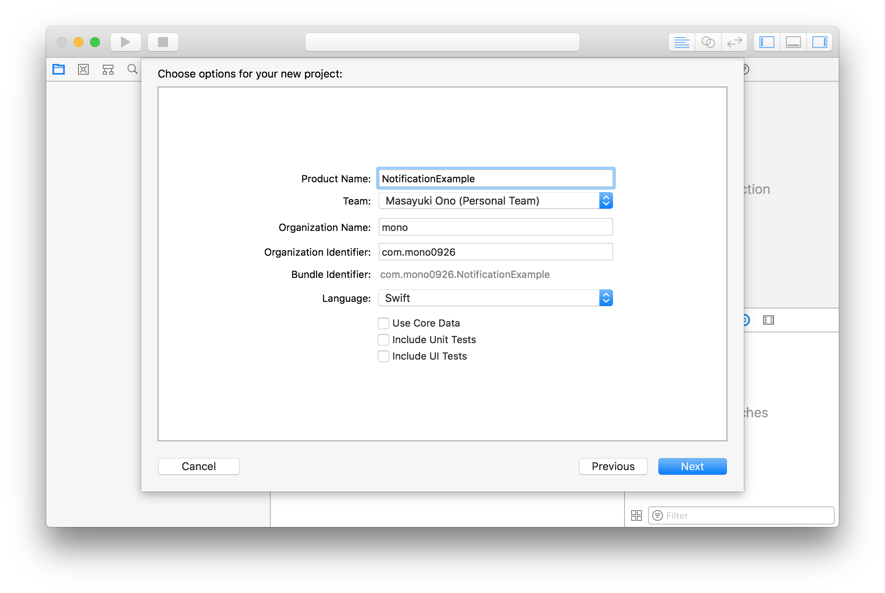
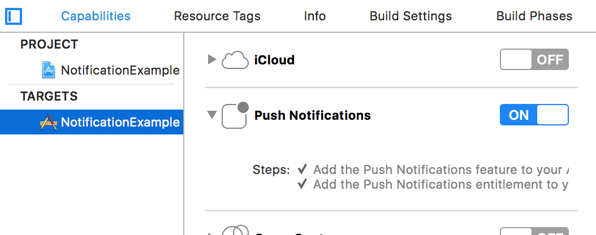

# 第4章 iOS プッシュ通知の基本的な実装方法

この章では、iOSアプリでプッシュ通知を受け取るために必要なdevice token(デバイストークン)を取得する手順について説明していきます。

## 4.1 device token(デバイストークン)とは？

プッシュ通知を発行する際に、その発行先をdevice tokenで指定します(次の章で詳しく説明します)。device tokenは、端末・アプリごとに一意となっていて、1つの有効なdevice tokenへ発行した通知はただ1つの端末の1つのアプリにのみ届くようになっています。また、そのアプリがアンインストールされた際などにそのdevice tokenは無効となり、そのdevice tokenへ向けてプッシュ通知を発行しても失敗し不達となります。

この章ではこのdevice tokenを取得する方法に絞って説明していきます。iOSアプリでのプッシュ通知周りの実装は多岐に渡りますが、それらは後の章で扱います。


## 4.2 Xcode プロジェクトの作成と設定

_これから説明するXcodeプロジェクトのサンプルは、サンプルコードの`NotificationExample.xcodeproj`プロジェクトの`Simple`ターゲットに含まれています。_

それでは、[iOS Certificates - Apple Developer](https://developer.apple.com/account/ios/certificate)で生成した各種ファイルを用いてXcodeでの作業を進めていきます。

### プロジェクトの作成

まずは、プロジェクトを作成します。形式は何でも良いですが、とりあえず一番シンプルな`Single View App`をオススメします。


次に、適当なProduct Name(アプリ名)・Teamを指定して新規アプリを作ります。



### プッシュ通知対応のためのプロジェクト設定

まず、プロジェクト設定にて作成したアプリターゲットを選び、Generalタブにて、第3章で作成したものを次のように適用します。

- Identity - Bundle Identifier: 作成したApp ID
- Signing - Team: 第3章の[iOS Certificates - Apple Developer](https://developer.apple.com/account/ios/certificate)上での作業で利用したTeam


もしもどこかが間違えているとエラーが表示されるので、そのエラーメッセージを見たり第3章を再度見るなどして解決してください。

うまくいった場合は、隣のCapabilitiesタブにて、Push Notificationsという項目が現れます(逆にGeneralタブでの設定が正しくないと項目が出てこないこともあります)。デフォルトはオフなので、オンに切り替えます。



以上で、device tokenを得るための設定は完了です。

## 4.3 device tokenの取得

それでは、device tokenを取得するための最小限のコードを書いていきます。以下、サポートバージョンはiOS 10以上となります。

まず、`AppDelegate.swift`を開きます。そして、[UserNotifications](https://developer.apple.com/documentation/usernotifications)フレームワークをimportします。これは、iOS 10で新しくできた通知用のフレームワークで、それまでUIKitに包含されていた通知周りが切り出され、以前と比べて大変使いやすくなっています。

{caption: "ファイルの冒頭でUserNotificationsをimport"}
```swift
import UserNotifications
```

次に、`AppDelegate`クラスの[-application:didFinishLaunchingWithOptions:](https://developer.apple.com/documentation/uikit/uiapplicationdelegate/1622921-application?language=objc)という、アプリが終了した状態から起動される度に毎回初めに必ず呼ばれるメソッド内に、以下の処理を書きます。

- 通知許可を求める
- 通知が許可された場合にdevice tokenをリクエスト

<<[TODO: code](codes/chapter4/AppDelegate1.swift)

それでは、上記コードを解説していきます。

### A: 通知許可を求める

[requestAuthorization(options:completionHandler:)](https://developer.apple.com/documentation/usernotifications/unusernotificationcenter/1649527-requestauthorization)というメソッドで、通知許可を求めるアラートを表示します。許可・不許可、いずれか1回選択されたら、以後そのアプリがアラートは出すことができず、変更する場合はユーザーが設定アプリでの変更操作をする必要があります。

そのため、本来はこのアラートはアプリ要件に応じて最適なタイミングで表示することが望ましいのですが、ドキュメントにも、[application:didFinishLaunchingWithOptions:](https://developer.apple.com/documentation/uikit/uiapplicationdelegate/1622921-application)で呼ぶのが基本で、あとで呼ぶ場合は気をつけて調整するように、と書いてあります。後のUXの章でこのあたり触れていきます。

> Typically, you perform all of your configuration before your application finishes launching. In iOS and tvOS, this means configuring your notification support no later than the application:didFinishLaunchingWithOptions: method of your UIApplication delegate. In watchOS, configure that support no later than the applicationDidFinishLaunching method of your WKExtension delegate. You may perform this configuration at a later time, but you must avoid scheduling any local or remote notifications targeting your app until this configuration is complete.
> [Local and Remote Notification Programming Guide: Managing Your App’s Notification Support](https://developer.apple.com/library/content/documentation/NetworkingInternet/Conceptual/RemoteNotificationsPG/SupportingNotificationsinYourApp.html#//apple_ref/doc/uid/TP40008194-CH4-SW1)

### B: 通知が許可された場合にdevice tokenをリクエスト

通知が許可されたら、次に[registerForRemoteNotifications()](https://developer.apple.com/documentation/uikit/uiapplication/1623078-registerforremotenotifications)というメソッドを呼び、device tokenの取得をリクエストします。これはアプリを起動するごとに毎回呼ぶ必要があります。

一見、一回device token取得できれば、再度問い合わせる必要は無いのでは？と思ってしまいますが、公式ドキュメントにはdevice tokenは変更されるうるので起動する度に毎回問い合わせるように、と明記されています。

> Never cache device tokens in your app; instead, get them from the system when you need them. APNs issues a new device token to your app when certain events happen. The device token is guaranteed to be different, for example, when a user restores a device from a backup, when the user installs your app on a new device, and when the user reinstalls the operating system. Fetching the token, rather than relying on a cache, ensures that you have the current device token needed for your provider to communicate with APNs. When you attempt to fetch a device token but it has not changed, the fetch method returns quickly.
> [Local and Remote Notification Programming Guide: Configuring Remote Notification Support](https://developer.apple.com/library/content/documentation/NetworkingInternet/Conceptual/RemoteNotificationsPG/HandlingRemoteNotifications.html#//apple_ref/doc/uid/TP40008194-CH6-SW1)

ただ、[観測ベースではiOS 9以上ではアプリ再インストールの時にのみdevice tokenが変わるようになっています](http://qiita.com/mono0926/items/9ef83c8b0de0e84118ac)。とはいえ、他のレアケースで変わり得るかもしれず、また今後のiOSバージョンで挙動が変わる可能性もあるので、ドキュメントに記載の通り、毎回起動する度にdevice tokenを問い合わせるのがセオリーです。

### C: メインスレッドに戻す

`requestAuthorization(options:completionHandler:)`のコールバックはバックグラウンドスレッドから返るので、メインスレッドから`registerForRemoteNotifications()`を呼びます。
実は筆者は、Xcode 8では`DispatchQueue.main.async`で囲まずに直接`registerForRemoteNotifications()`を呼んでしまっていました(大半の方はそう書いていたのでは無いでしょうか？)。Xcode 9で[Main Thread Checker](https://developer.apple.com/documentation/code_diagnostics/main_thread_checker)という、`UIKit`などのメインスレッドから呼ばれる前提のAPIにバックグラウンドスレッドからアクセスがあった際に検知する仕組みが導入され、それに指摘されたのでメインスレッドに戻す処理を加えました。UI更新では無いのでメインスレッドに戻さずともあまり問題が無さそうに見え、かつ以前バックグランドから呼び出していた時も全く問題なく動いていたので必ずしも必要かは不明ですが、指摘通りにメインスレッドから呼び出すに越したことはないと思っています。

### `registerForRemoteNotifications()`の結果のハンドリング

`registerForRemoteNotifications()`でdevice tokenの取得リクエストが走り、その結果が`AppDelegate`クラスの次のいずれかのメソッドに返ります。前者は失敗時後者は成功時に呼ばれます。


<<[TODO: code2](codes/chapter4/AppDelegate2.swift)

#### 失敗時のハンドリング

まずは、失敗時の典型例を2つ紹介します。

1つ目は、シミュレーターで実行した時のエラーです。


E> Domain=NSCocoaErrorDomain Code=3010 "remote notifications are not supported in the simulator" UserInfo={NSLocalizedDescription=remote notifications are not supported in the simulator}

シミュレーターは通知に対応しておらず、常にこのエラーが返ってきてしまい、エラーログとして出すのは不適切だろうということで上記コードでは`TARGET_OS_SIMULATOR == 0`では無い時(シミュレーターの時)はINFOレベルのログを出すにとどめています。

2つ目は、CapabilitiesでPush Notificationsをオンにしていない場合です。

E> Domain=NSCocoaErrorDomain Code=3000 "no valid “aps-environment” entitlement string found for application" UserInfo={NSLocalizedDescription=no valid “aps-environment” entitlement string found for application}

その他、設定ミスによっていくつかパターンがありますが、エラーログを落ち着いて確認したり調べたりして対処していきましょう。

#### 成功時のハンドリング

ここまで記載通りに処理を記述していて、実機実行した場合、後者のメソッドが呼ばれて、Deta型のdeviceTokenが取得できます。Data型のまま取り回す場合もありますが、16進数のString型に変換して取り扱うことも多いです。また、ログに表示するときもそちらが見やすいですね。

残念ながら、16進数のString型に変換する標準メソッドは用意されていないですが、Swiftの場合、`deviceToken.map { String(format: "%.2hhx", $0) }.joined()`という比較的簡単な記述で変換できます。この変換方法は筆者が以前色々考えた末にベストだと思った書き方です(参考: [Swift 3.0でのプッシュ通知用のDevice TokenのData型から16進数文字列への変換方法 - Qiita](http://qiita.com/mono0926/items/3cf0dca3029f32f54a09))。

`token: xxxxxxxxxxxxxxxx`のような文字列がコンソールされますが、次章ではそれを用いてプッシュ通知を発行してみます。

// TODO: iOS 9非対応の言い訳