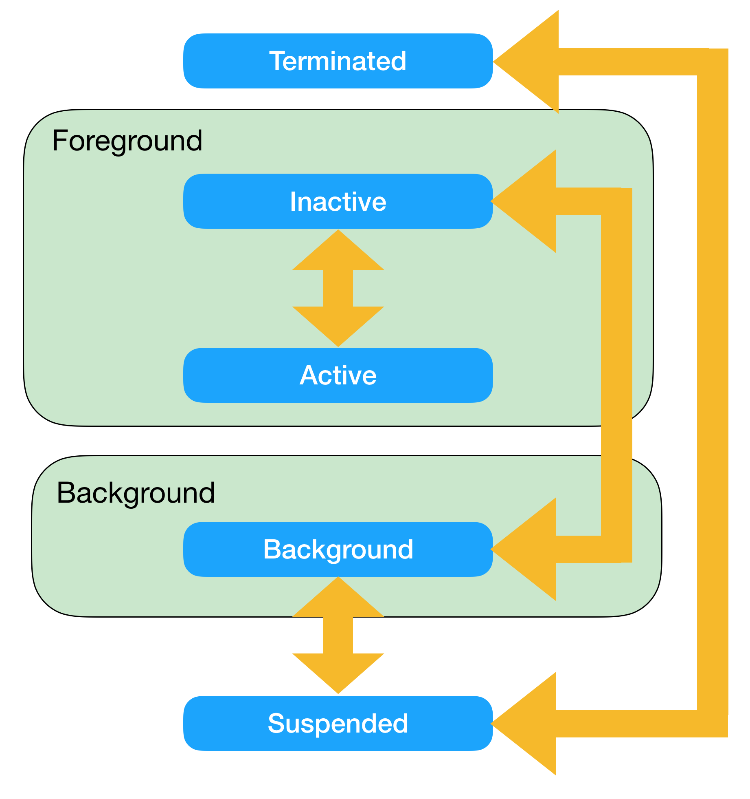
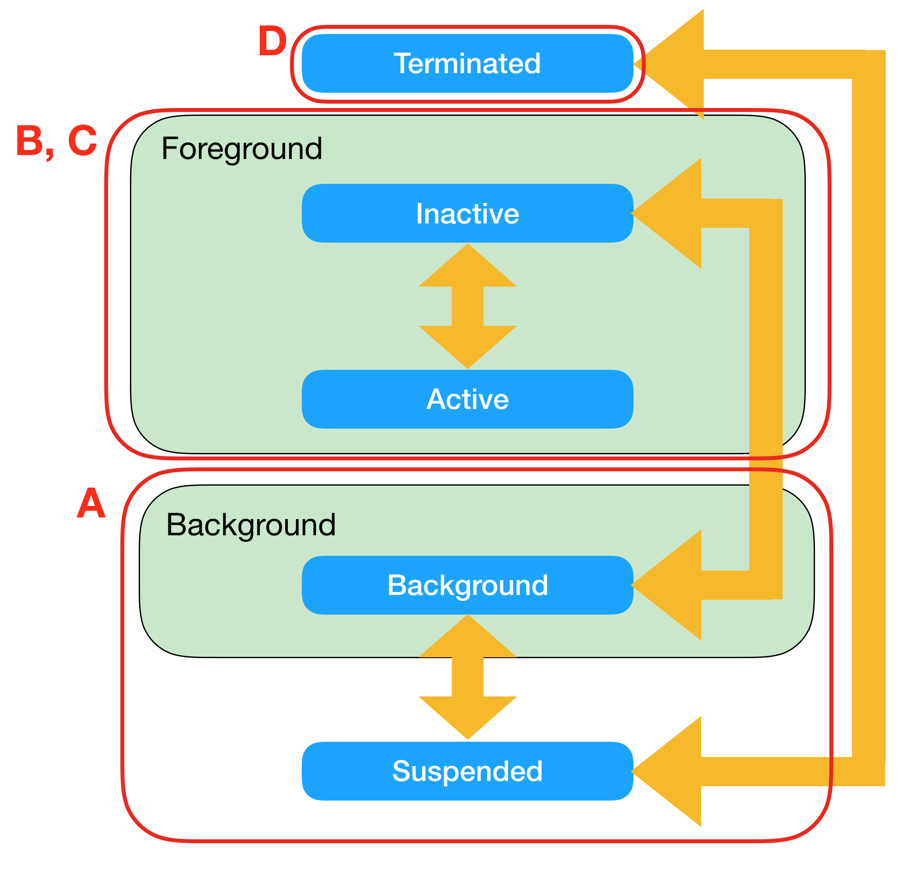
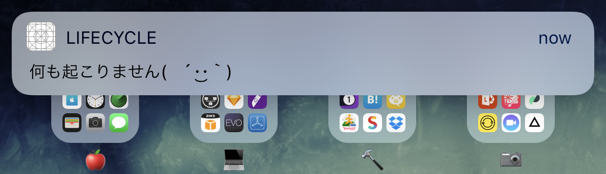

# 第5章 プッシュ通知とライフサイクル

前章までで、任意のタイミングで自由にプッシュ通知を発行してアプリで受け取れるようになりました。本章では、アプリが様々な状態でプッシュ通知を受け取った際のハンドリングについて説明していきます。

[The App Life Cycle](https://developer.apple.com/library/content/documentation/iPhone/Conceptual/iPhoneOSProgrammingGuide/TheAppLifeCycle/TheAppLifeCycle.html)

## 5.1 iOSアプリのライフサイクル

[iOSアプリのライフサイクル](https://developer.apple.com/library/content/documentation/iPhone/Conceptual/iPhoneOSProgrammingGuide/TheAppLifeCycle/TheAppLifeCycle.html)は、大きく以下の5つの状態があります。どの状態でプッシュ通知を受け取るか、通知をタップして起動されるかで、適切なハンドリング方法は異なってきます。

- Terminated
    - アプリが完全に終了した状態
- Inactive
    - アプリが開かれているがユーザーが操作できない状態
    - ActiveとBackgroundの合間
- Active
    - アプリが実行中でユーザーが操作できる状態
- Background
    - アプリが閉じたがプログラムはまだ動いている状態
- Suspended
    - アプリの実行はなされていないが、まだ終了しておらずメモリに残っていていつでも即座に再開できる状態

以上を踏まえた上で、ライフサイクルを考慮したプッシュ通知ハンドリングの説明をしていきます。

## 5.2 プッシュ通知バナーがタップされた時のハンドリング

プッシュ通知バナーがタップされるタイミングは以下の4つに大別されます。

- A: アプリ閉じたがまだterminatedになっていない状態
- B: アプリ開いた状態
- C: アプリ開いた状態で通知バナータップ(iOS 10～)
- D: terminatedから通知経由で起動(これが確認面倒) 

### A: アプリ閉じたがまだterminatedになっていない状態から通知経由で起動 

後述のバックグラウンド通知をオンにしない限りは、アプリが閉じた状態でプッシュ通知を受け取っただけではアプリ側では何も起こりません。

通知バナーをタップしてアプリが起動したタイミングはアプリで受け取れますが、第3章で書いた最小限の実装ではその処理が欠けているので、追記していきます。

まずは、`UNUserNotificationCenter`のdelegateを設定して、通知イベントを受け取れるようにします。ここではself(`AppDelegate`)を設定していますが、実アプリでは適宜別クラスに移譲した方が良いです。

<<[TODO: code](codes/chapter5/AppDelegate1.swift)

このままでは次のコンパイルエラーが発生するので、メソッドを実装していきます。

E> Cannot assign value of type 'AppDelegate' to type 'UNUserNotificationCenterDelegate?'

[UNUserNotificationCenterDelegate](https://developer.apple.com/documentation/usernotifications/unusernotificationcenterdelegate)に準拠するには次の2つのメソッド実装が必要です。

- [userNotificationCenter(_:didReceive:withCompletionHandler:)](https://developer.apple.com/documentation/usernotifications/unusernotificationcenterdelegate/1649501-usernotificationcenter)
- [userNotificationCenter(_:willPresent:withCompletionHandler:)](https://developer.apple.com/documentation/usernotifications/unusernotificationcenterdelegate/1649518-usernotificationcenter)

通知経由でアプリが起動された時のハンドリングとして以下を記述します。

<<[TODO: code](codes/chapter5/AppDelegate2.swift)

通知バナーをタップしてアプリが開かれるタイミングで、以下のログ出力がなされます。

E> applicationState: inactive
userInfo: [AnyHashable("aps"): {
    alert =     {
        body = "hello.";
    };
}]

InActiveの状態で`userNotificationCenter(_:didReceive:withCompletionHandler:)`が呼ばれることが分かりました。また、`completionHandler()`は、それを省略すると次の警告が出力されてしまいます。プッシュ通知経由で何か処理する場合、その完了タイミングをOSに知らせるためのクロージャーですが、ここでは単にログ出力しているだけなので、メソッドを抜けるタイミングで単純に呼んでいます。

E> Warning: UNUserNotificationCenter delegate received call to -userNotificationCenter:didReceiveNotificationResponse:withCompletionHandler: but the completion handler was never called.

ちなみに、[UIApplicationState](https://developer.apple.com/documentation/uikit/uiapplicationstate)はそのまま出力するだけでは、`UIApplicationState`という文字出力になってしまい状態が分からないので、次のextensionを定義しています。

<<[TODO: code](codes/chapter5/UIApplicationState.extension.swift)

というわけで、今回は単純にログ出力しただけでしたが、このようにプッシュ通知経由で開かれた時にそのイベントを受け取ってハンドリングできるようになりました。

### B: アプリ開いた状態で通知

アプリを開いた状態で通知が来ると`userNotificationCenter(_:willPresent:withCompletionHandler:)`が呼ばれるので、先ほどは空実装としていましたが、ログ出力するようにします。

<<[TODO: code](codes/chapter5/AppDelegate3.swift)

アプリを開いた状態で通知が来ると、次のログ出力がされるようになりました。

E> applicationState: active
userInfo: [AnyHashable("aps"): {
    alert =     {
        body = "hello.";
    };
}]

この時、通知を受け取ったにも関わらず、通知バナーは表示されませんが、次のように`completionHandler([.badge, .alert, .sound])`を呼ぶと、通知バナーを表示することもできます。`[.badge, .alert, .sound]`は、バッジ・通知バナー・通知音から反応してほしいものものをホワイトリスト指定します。`userNotificationCenter(_:didReceive:withCompletionHandler:)`の`completionHandler()`と違って、こちらの`completionHandler`は呼ばなくても良いです。

<<[TODO: code](codes/chapter5/AppDelegate4.swift)

### C: アプリ開いた状態で通知バナータップ(iOS 10～)

- D: terminatedから通知経由で起動(これが確認面倒) 

